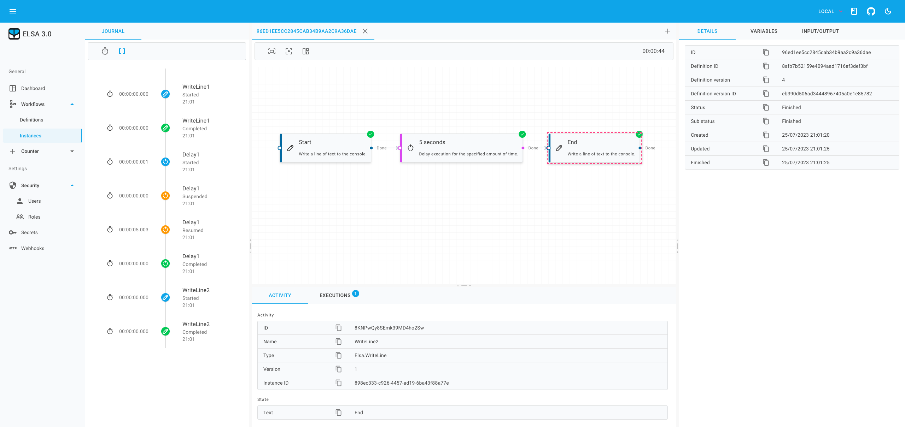

# Elsa Studio

<a href="./artwork/screenshot-1.png" target="_blank">
  

    
  

</a>

Elsa Studio is a modular, extensible application framework built with MudBlazor and is used to manage Elsa workflows and related entities.

## Prerequisites

- **.NET SDK**: Ensure you have both [.NET 7](https://dotnet.microsoft.com/download/dotnet/7.0) and [.NET 8](https://dotnet.microsoft.com/download/dotnet/8.0) SDKs installed.
- **Node.js and npm**: Install [Node.js](https://nodejs.org/) (which includes npm) for the frontend tooling.

## Setup

1. **Clone the repository**: `git clone https://github.com/elsa-workflows/elsa-studio.git`
2. **Navigate to the project directory**: `cd elsa-studio`

## Before you build

There are some assets that require `NPM` to build the assets prior to the project building. These have been configured to use an MSBUILD pre-build step and should not require any extra
steps but should you run into any issues or want to build these ahead of time, take the following steps

1. **Navigate to ClientLib folder in Elsa.Studio.DomInterop**: `cd .\src\framework\Elsa.Studio.DomInterop\ClientLib`
1. **Get `NPM` ready to run**: `npm install`
1. **Build the assets**: `npm run build`
1. **Navigate to ClientLib folder in Elsa.Studio.Workflows.Designer**: `cd .\src\modules\Elsa.Studio.Workflows.Designer\ClientLib`
1. **Get `NPM` ready to run**: `npm install`
1. **Build the assets**: `npm run build`

## Build and Run

1. **Restore .NET dependencies**: `dotnet restore Elsa.Studio.sln`
1. **Build the project**: `dotnet build Elsa.Studio.sln`
1. **For Blazor Server Host**: `dotnet run --project .\src\hosts\Elsa.Studio.Host.Server\Elsa.Studio.Host.Server.csproj --framework net8.0`
1. **For Blazor Server WASM**: `dotnet run --project .\src\hosts\Elsa.Studio.Host.Wasm\Elsa.Studio.Host.Wasm.csproj --framework net8.0`

Explore the [Elsa Studio GitHub repository](https://github.com/elsa-workflows/elsa-studio) for more detailed information.