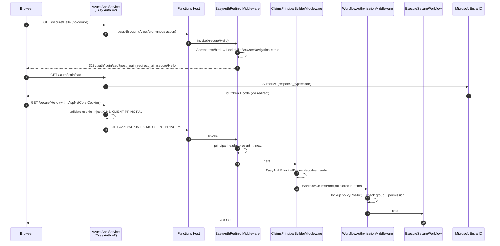
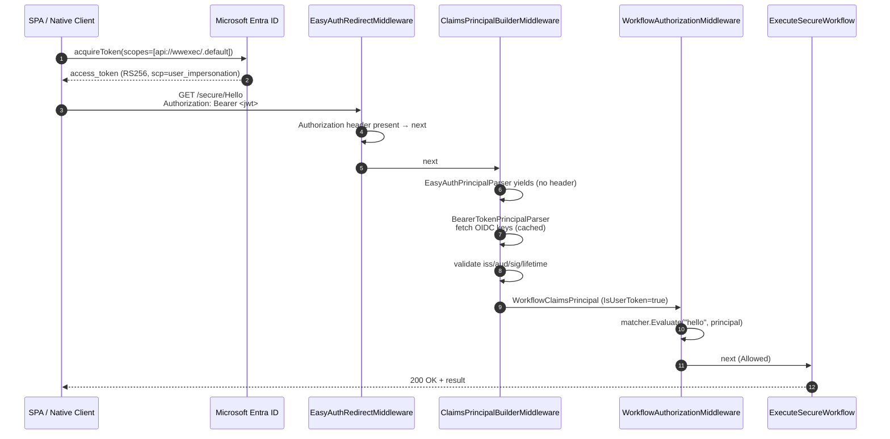
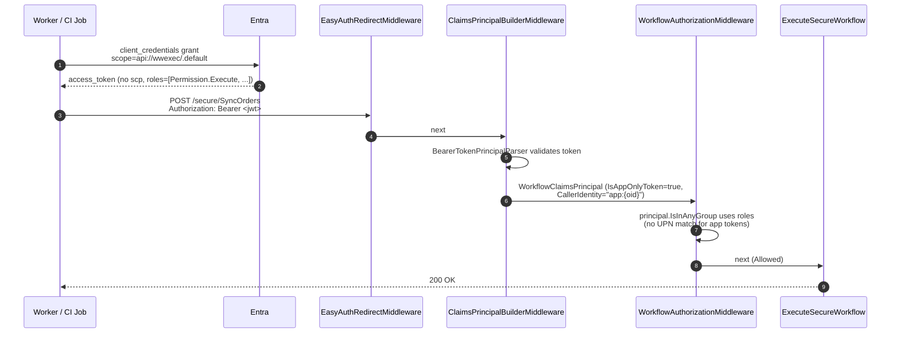
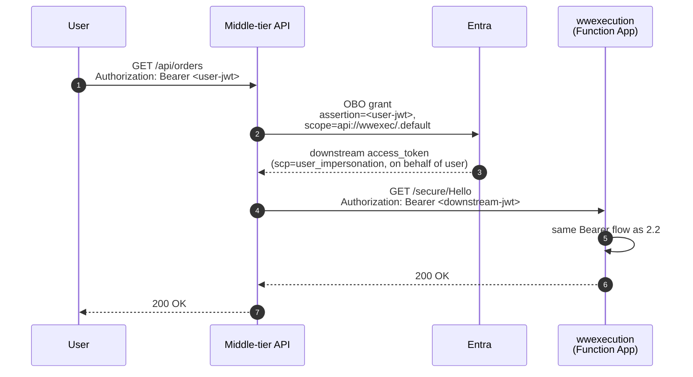
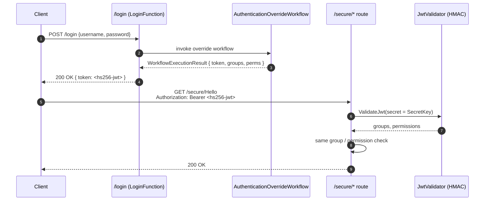
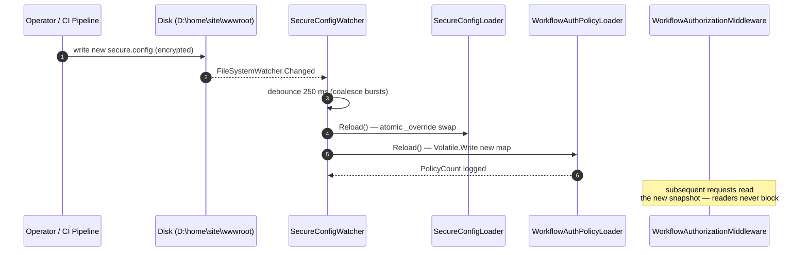

# Part 2 — Data Flow Diagrams
## Warewolf Execution Lightweight — Authentication & Authorization

> Sequence diagrams (Mermaid) for every supported authentication path through
> `Warewolf.Execution.Lightweight`.  Read this alongside Part 1 (Architecture)
> and Part 3 (Implementation) when reasoning about a specific token or request
> shape.

Pipeline order (set in `HostBuilderExtensions.ConfigureWarewolf`):

```
EasyAuthRedirectMiddleware → ClaimsPrincipalBuilderMiddleware → WorkflowAuthorizationMiddleware → Function
```

---

## 2.1 Browser flow — interactive Easy Auth login

User navigates a browser to `/secure/Hello` without a session.



---

## 2.2 API flow — bearer token (delegated user_impersonation)

SPA / native client posts a JWT obtained via MSAL `acquireToken`.



---

## 2.3 Daemon flow — app-only client credentials

Background service uses application identity (`scp` absent, `roles` carries app permissions).



---

## 2.4 OBO flow — middle-tier on-behalf-of

User-facing API exchanges its bearer token for a downstream token to call wwexecution.



The downstream token preserves the original user's `oid`, `name`, and `roles`,
so policy decisions in wwexecution attribute the action to the real user — not
the middle-tier service principal.

---

## 2.5 Legacy HMAC flow — `/login` issued JWT

Pre-Entra clients exchange credentials for a Warewolf-signed JWT via the
optional `AuthenticationOverrideWorkflow` (CFG-05).



> The legacy HMAC path uses the same `WorkflowAuthorizationMiddleware`; the
> only difference is which parser produced the principal (the legacy HMAC
> validator path runs inside `WorkflowHttpFunction`, not as a parser, for
> compatibility with the original Warewolf web server).

---

## 2.6 Hot-reload of `secure.config` (POL-08)

Operator updates the encrypted policy file on disk; no restart needed.



---

## 2.7 Authorization decision matrix (single request)

Common path applied after the principal is built.

```mermaid
flowchart TD
    A[/Path classified/] --> B{path prefix?}
    B -->|/public/*| OK[next]
    B -->|/secure/*<br/>or /services/*| C{IsDevelopment<br/>and bypass header?}
    C -->|yes| OK
    C -->|no| D{principal<br/>authenticated?}
    D -->|no| U[401 unauthorized<br/>+ correlation id<br/>+ AuditLogger.LogAuthOutcome]
    D -->|yes| E[ExtractWorkflowName]
    E --> F[routeRegistry.GetRequiredPermissions<br/>fallback: View|Execute]
    F --> G[matcher.Evaluate]
    G --> H{outcome}
    H -->|Allowed| OK
    H -->|NoPolicyFound| OK[+ warning log]
    H -->|Forbidden| X[403 forbidden<br/>+ auth.policy.denied metric<br/>+ correlation id<br/>+ AuditLogger.LogAuthOutcome]
```

---

## Cross-references

| Diagram | Code                                                                                          |
|---------|-----------------------------------------------------------------------------------------------|
| 2.1     | `Auth/Middleware/EasyAuthRedirectMiddleware.cs`                                              |
| 2.2     | `Auth/Parsers/BearerTokenPrincipalParser.cs`, `Auth/Models/EntraAuthOptions.cs`              |
| 2.3     | `Auth/WorkflowClaimsPrincipal.cs` — `IsAppOnlyToken`                                         |
| 2.4     | Token validation is identical to 2.2; OBO is a client-side concern                           |
| 2.5     | `Functions/LoginFunction.cs`, `Security/JwtValidator.cs`                                     |
| 2.6     | `Auth/SecureConfigWatcher.cs`, `Auth/WorkflowAuthPolicyLoader.cs`                            |
| 2.7     | `Auth/Middleware/WorkflowAuthorizationMiddleware.cs`                                         |
