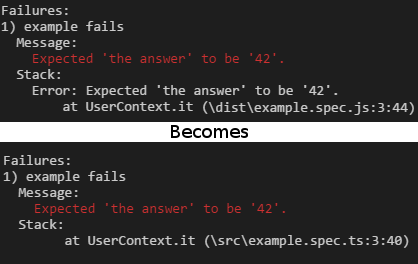

# Jasmine Typescript Console Reporter

[](https://www.npmjs.com/package/jasmine-ts-console-reporter)
[](https://github.com/SeanSobey/JasmineTSConsoleReporter/issues)
[](https://github.com/SeanSobey/JasmineTSConsoleReporter/blob/master/LICENSE)

A [Jasmine](https://jasmine.github.io/) Console Reporter that remaps Typescript files. This will use source maps to remap the error stack file paths and line numbers to the source typescript files.

## Preview



## Installation

`npm i jasmine-ts-console-reporter`

## Usage

Create a helper file for jasmine, eg specs/helpers.js

```js
const TSConsoleReporter = require('jasmine-ts-console-reporter');

jasmine.getEnv().clearReporters(); // Clear default console reporter
jasmine.getEnv().addReporter(new TSConsoleReporter());
```

Load the helper file in Jasmine, eg on node jasmine.json:

```json
{
	"helpers": [
		"specs/helpers.js",
	]
}
```

### Custom sourceMapProvider

For more intricate usage scenarios, like using [istanbul](https://github.com/gotwarlost/istanbul) where the sourcemaps for instumented files are held in memory, you can locate the sourcemaps via a callback:

```js
new TSConsoleReporter({
	sourceMapProvider: (fileName) => {
		const map = fetchMySourceMap(fileName);
		const sourcesRelativeTo = '< Relative path from source map file to source file. >';
		return map ? { map, sourcesRelativeTo } : null;	// Return null if no source map is found.
	}
});
```

The return object must be the same as [source-map-resolve](https://www.npmjs.com/package/source-map-resolve#sourcemapresolveresolvesourcemapcode-codeurl-read-callback).

### Extra stack filter ignore

You can provide additional ignore patterns for the stack trace (on top the built in exclusion of jasmine sources), this is useful for when you are using test frameworks that show up in the stack trace like [typemoq](https://github.com/florinn/typemoq).

```js
// regexp
new TSConsoleReporter({
	stackFilterIgnore: /node_modules\\typemoq/
});
// or glob
new TSConsoleReporter({
	stackFilterIgnore: '**/node_modules/typemoq/**'
});
```

### Custom title filter

You can provide additional filtering for the spec title, this is useful for when you want to limit or decorate the title output in some way.

```js
new TSConsoleReporter({
	titleFilter: (title) => (title.length > 100) ? title.substr(0, 100 - 1) + '...' : title
});
```

### Custom message filter

You can provide additional filtering for the error message, this is useful for when you want to limit or decorate the message output in some way.

```js
new TSConsoleReporter({
	messageFilter: (message) => message.split('\n')[0]
});
```